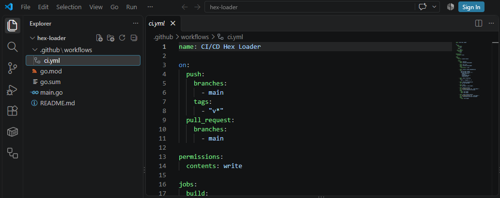
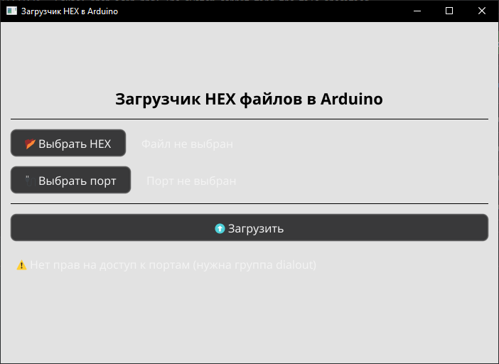
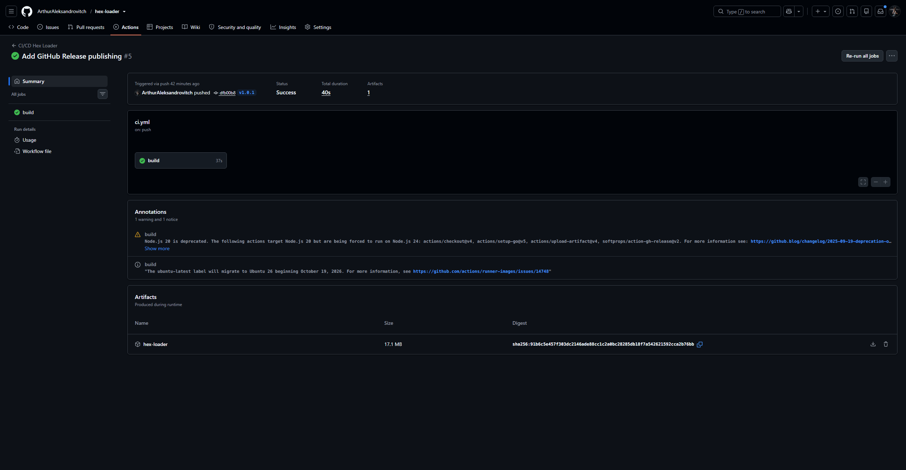
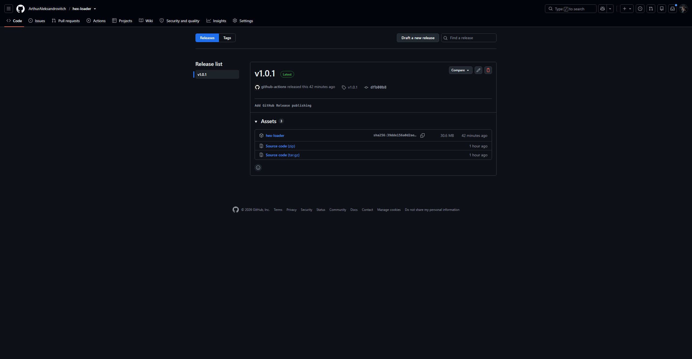

# Hex Loader

Графическое приложение для загрузки HEX-файлов в платы Arduino.

Проект разработан на языке Go с использованием библиотеки Fyne и автоматизированной сборкой через GitHub Actions. Готовая версия приложения публикуется в GitHub Releases.

## Возможности

* выбор HEX-файла;
* выбор последовательного порта;
* выбор платы Arduino;
* определение доступных плат;
* загрузка HEX-файла через Arduino CLI;
* отображение статуса операции;
* индикатор прогресса загрузки;
* обработка ошибок подключения и загрузки.

## Технологии

* **Go 1.23+**
* **Fyne 2.8.1** — графический интерфейс;
* **Arduino CLI** — работа с Arduino;
* **GitHub Actions** — CI/CD;
* **GitHub Releases** — публикация готовой версии приложения.

---

## Этапы разработки

### 1. Создание проекта

На первом этапе был создан проект **Hex Loader** на языке Go. Была настроена структура проекта и создан файл `main.go`.

Структура проекта:

### 2. Разработка графического интерфейса

Для создания графического интерфейса использована библиотека **Fyne**.

В приложении реализованы элементы для выбора HEX-файла, последовательного порта и платы Arduino, а также отображение состояния загрузки.

Запущенное приложение:

### 3. Работа с Arduino

Для взаимодействия с Arduino используется **Arduino CLI**.

Приложение позволяет выбрать последовательный порт и выполнить загрузку HEX-файла на подключенную плату.

Проверка работы с последовательным портом:

### 4. Настройка зависимостей

Для проекта были настроены необходимые зависимости Go и библиотеки Fyne.

Зависимости проекта описаны в файлах:

* `go.mod`
* `go.sum`

Также была выполнена проверка форматирования исходного кода с помощью `gofmt`.

### 5. Настройка GitHub Actions

Для автоматизации CI/CD был создан workflow:

`.github/workflows/ci.yml`

Workflow выполняет следующие действия:

1. получение исходного кода из репозитория;
2. установка Go;
3. установка системных зависимостей Fyne;
4. проверка форматирования через `gofmt`;
5. загрузка зависимостей;
6. сборка приложения;
7. публикация артефакта;
8. создание GitHub Release при создании версии по тегу.

Результат успешного выполнения GitHub Actions:

### 6. Публикация GitHub Release

Для публикации готовой версии используется GitHub Releases.

После создания тега `v1.0.1` workflow автоматически выполнил сборку приложения и опубликовал результат в Release.

Первый опубликованный релиз проекта:

## Результат

В результате был разработан графический загрузчик HEX-файлов для Arduino на языке Go.

Проект содержит:

* исходный код приложения;
* настроенные зависимости;
* CI/CD workflow;
* автоматическую сборку;
* публикацию готового приложения в GitHub Releases;
* документацию с описанием этапов разработки.

### Версия

**v1.0.1**

### Репозиторий

[GitHub — Hex Loader](https://github.com/ArthurAleksandrovitch/hex-loader)
